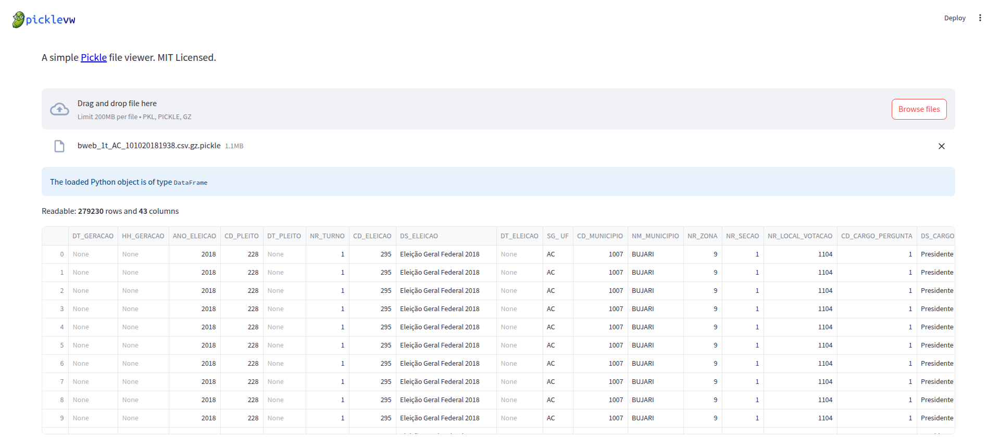

<p>
    
</p>
<div style="display: flex;">


[](https://codecov.io/github/jonathanciapetti/picklevw)

[](https://github.com/psf/black)

</div>

<br />

**picklevw** (pronunced *pickleview*) is a simple Python web application, designed to read and display pickle files
using Pandas and Streamlit. It's basically a GUI wrapping `pandas.read_pickle()`.

Try it live on [picklevw.streamlit.app](https://picklevw.streamlit.app)

<br />

### Getting Started

---

#### Installation

Clone the repository and install the required dependencies (possibly on a virtual environment):

```console
git clone https://github.com/jonathanciapetti/picklevw.git
cd picklevw
python3 -m venv ./venv
source venv/bin/activate
pip install -r requirements.txt
```

#### Running the App

To start the application, run:

```console
streamlit run src/picklevw.py
```

Here's a screenshot of the app:
<p>
    
</p>


<br />

### Safetey checks

`picklevw` relies on [`Fickling`](https://github.com/trailofbits/fickling) to detect potentially malicious pickles. Fickling depends on [`distutils`](https://docs.python.org/3/library/distutils.html) which is only available up to Python version that provides it is 3.11. Therefore, Python 3.11 is the latest version that `picklevw` supports. 

### Contributing

---

Contributions are <ins>**welcome**</ins>! If you have any ideas, suggestions, or bug reports, please open an issue or
submit a pull request.

### License

This project is licensed under the MIT License - see the LICENSE.txt file for details.

### Contacts

- Repo: [https://github.com/jonathanciapetti/picklevw](https://github.com/jonathanciapetti/picklevw)
- Email: [jonathan.ciapetti@normabytes.com](mailto:jonathan.ciapetti@normabytes.com)
