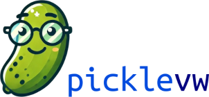

[//]: # (![Static Badge]&#40;https://img.shields.io/badge/build-passed-green&#41;)

<p align="center">
    
</p>
<p align="center">
    <a href="https://circleci.com/gh/badges/picklevw/tree/main">
        </a>
    <a href="https://circleci.com/gh/picklevw/daily-tests">
        </a>
    <a href="https://coveralls.io/github/badges/picklevw">
        </a>
</p>


<!--  -->

**picklevw** (pronunced *pickleview*) is a small desktop application built with Python, designed to read and display pickle files using Pandas and Tkinter.
It's basically a GUI wrapping `pandas.read_pickle()`.

### ✨ Features

- User-friendly Interface: simple and intuitive GUI built with Tkinter.
- Fast Data Loading: efficiently reads pickle files using Pandas.
- No freezing GUI: GUI and data live in different processes.

---

### 🚀 Getting Started

Follow these steps to get picklevw up and running on your machine.

#### Installation

Clone the repository and install the required dependencies:

```bash
git clone https://github.com/yourusername/picklevw.git
cd picklevw
pip install -r requirements.txt
```
#### Running the App

To start the application, run:

```bash
python3 picklevw.py
```

#### 🛠️ Dependencies
- *pandas* >= 1.5
- *tkinter* (usually included with Python installations)
- *prettyprinter*

#### ⌛ TODOs
- GUI testing [...]
- [...]

---

### 🤝 Contributing
Contributions are <ins>**welcome**</ins>! If you have any ideas, suggestions, or bug reports, please open an issue or submit a pull request.


### 📜 License
This project is licensed under the MIT License - see the LICENSE file for details.

### 📫 Contacts
- Repo: [https://github.com/jonathanciapetti/picklevw](https://github.com/jonathanciapetti/picklevw)
- Email: [jonathan.ciapetti@normabytes.com](mailto:jonathan.ciapetti@normabytes.com)

Thank you for checking out picklevw! We hope you find it useful. Feel free to reach out if you have any questions or feedback.
